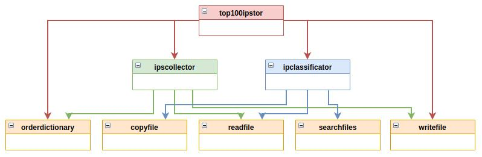

# Tor Network Top 100 IPs
Tool to get the top 100 of the fastest nodes in the Tor network.

Just execute <b>top100ipstor.py</b> to get the top list. The script will read the file <i>'/var/lib/tor/cached-microdesc-consensus'</i> and get the 100 fastest IPs. In the following executions, the script will take the previously collected IPs to perform a global measurement.

